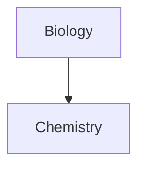

# head 1
## head 2
### head 3
###### head 6

**This is bold text**

***bold and italic***
___bold and italic___

__This is also bold text__

*Italic one*
_Also italic one_

~~Striked out text~~

==Highlighted text==

**Bold text and _nested italic text_**

\*\*This line won't be bold\*\*

*\*This line will be italic and show the asterisks*\*

>[!info]
-
+
*

1.
2.
3.

- [x] Hotkeys
- [x] templates
- [ ] 3 plugins
- [x] core plugins


* `#include <iostream>`

``code with a backtick ` inside``

```cpp
#include <iostream>

using namespace std;
```

	#include <iostream>

>[!info]
>footnote - an additional piece of information printed at the bottom of a page.


This is a simple footnote[^1]. 
[^1]: This is the referenced text. 
[^2]: Add 2 spaces at the start of each new line. This lets you write footnotes that span multiple lines. 
[^note]: Named footnotes still appear as numbers, but can make it easier to identify and link references.

| First name | Last name |     |
| ---------- | --------- | --- |
| Max        | Planck    |     |
| Marie      | Curie     |     |

 First name | Last name 
 ---------- | ----------
Max         |Planck     
Marie       |Curie      

| Left-aligned text | Center-aligned text | Right-aligned text |
| :---------------- | :-----------------: | -----------------: |
| Content           |       Content       |            Content |




> Truth is ever to be found in simplicity, and not in the multiplicity and confusion of things.

\-Isaac Newton

> [!note] 
>  

-------
$$
\begin{cases}
2 + 5x \leq 0 \\
x > 2 \\
3x = 0
\end{cases}
$$

$$\begin{equation}
\begin{pmatrix}
  1       & x^1_0   & x^2_0   & \cdots  & x^{degree}_0  \\
  1       & x^1_1   & x^2_1   & \cdots  & x^{degree}_1  \\
  \vdots  & \vdots  & \vdots  & \ddots  & \vdots \\
  1       & x^1_n   & x^2_n   & \cdots  & x^{degree}_n  \\
\end{pmatrix}
\end{equation}$$

```{toggle}
Some hidden toggle content!


```

$$\boxed{f(x)-P_n(x)\leq\frac{(b-a)^a}{2^n2^{n-1}(n+1)!}f^{n+1}(\xi)}$$
# A
# B
# C
# D
# E
# F
# G
# H
# I
# J
# K
# L
# M
# N 
# O
# P
# Q
# R
# S
# T
# U
# V
# W
# X
# Y
# Z


# A
# B
# C
# D
# E
# F 
# G
# H
# I
# J
# K
# L
# M
# N
# O
# P
# Q
# R
# S
# T
# U
# V
# W
# X
# Y 
# Z
# Ä
# Ö
# Ü
# ß

